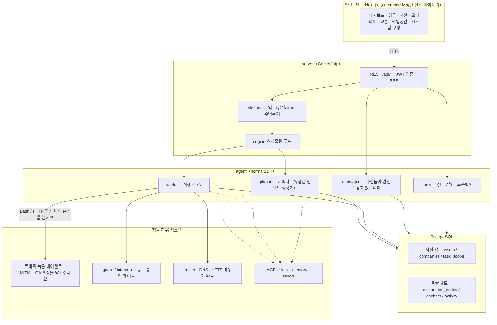
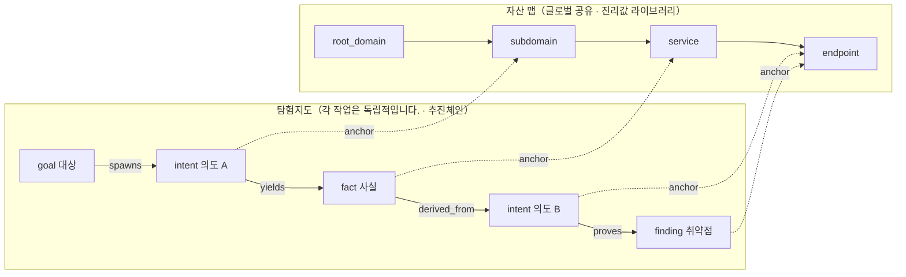
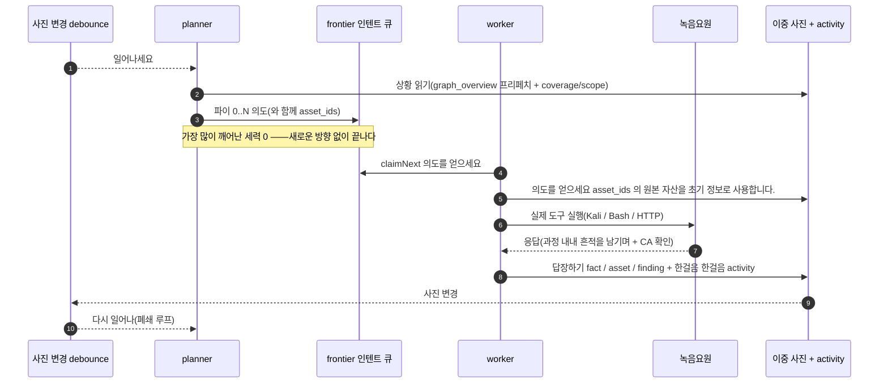
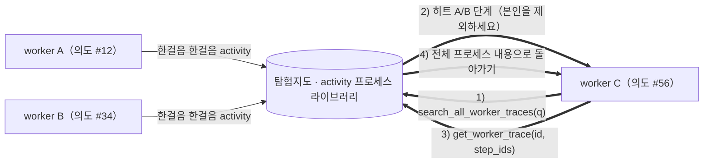
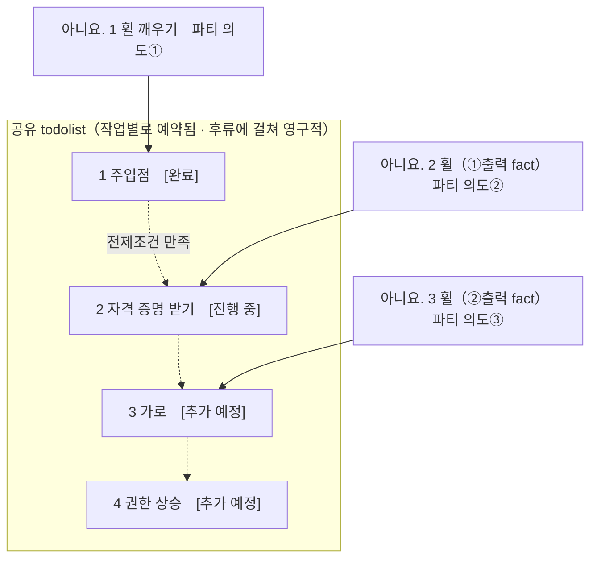

<div align="center">

# ARTEX

AI 자율 침투 테스트 시스템(Go 백엔드 + Next.js 프런트엔드)


🌐 **온라인 데모**: [https://artex-demo.vercel.app/](https://artex-demo.vercel.app/)

</div>

---

## 스크린샷 미리보기

> 전체 화면과 동작은 [온라인 데모](https://artex-demo.vercel.app/)에서 확인할 수 있습니다.

| 대시보드（개요 / Token 소비 / 활동 스트림） | 작업 목록 |
| :---: | :---: |
|  |  |

| 작업 실행 과정(대화 / 도구 호출) | 탐색 경로 |
| :---: | :---: |
|  |  |

| 발견 사항 | 자산 |
| :---: | :---: |
|  |  |

| 자산 커버리지 그래프(힘 기반 배치 · 테스트한 항목 강조 · 노드 접기/펼치기) |
| :---: |
|  |

| 트래픽 기록 | 사람 참여형 대화 |
| :---: | :---: |
|  |  |

| Agent 관리 | LLM 구성 |
| :---: | :---: |
|  |  |

| 차단 승인 | 백엔드 로그 |
| :---: | :---: |
|  |  |


---

## 승인기록 내역

전체 승인 기록, 작업별 차단 승인, 대화 속 승인 카드에서 상세 정보를 펼쳐 볼 수 있습니다. 화면 구조는 [AegisHook의 승인 상세 구성 요소](https://github.com/RuoJi6/AegisHook/blob/main/web/src/components/CallDetail.vue)를 참고하고 ARTEX의 구성 요소와 테마를 사용합니다.


## 자산 동기화(ScopeSentry)

[ScopeSentry](https://github.com/Autumn-27/ScopeSentry)에서 자산 데이터를 직접 동기화해 중복 수집을 줄일 수 있습니다.

- "**자산 동기화**" 페이지에서 ScopeSentry 주소와 API 키를 입력하여 데이터 소스에 액세스합니다.
- **프로젝트** 또는 **작업** 차원에 따라 동기화할 대상 및 자산 유형(도메인 이름/하위 도메인/IP/포트/사이트/엔드포인트...)을 선택합니다.
- 한 번에 가져온 자산을 회사별 범위에 맞춰 묶고, ARTEX 자산 그래프에서 에이전트가 탐색할 수 있습니다.

---

## 설치

> **PostgreSQL**이 필요합니다. 탐색을 실행하려면 **LLM**도 설정해야 합니다(`ANTHROPIC_API_KEY` 또는 `OPENAI_API_KEY`; UI에서도 설정 가능).

### 방법 1: 원클릭 설치 스크립트(권장)

```bash
git clone https://github.com/Autumn-27/ARTEX.git
cd ARTEX
./install.sh
```

스크립트가 Docker를 확인하고 필요하면 설치한 뒤, **① 전체 Docker 실행** 또는 **② 로컬 컴파일 및 실행** 방식을 선택하게 합니다.

- **① 전체 Docker 실행**: PostgreSQL 비밀번호를 입력합니다(빈 값이면 임의 생성). 스크립트가 `.env`를 작성하고 `docker compose up -d`를 실행합니다.
- **② 로컬 실행**: 기존 데이터베이스에 연결하거나 Docker로 새 데이터베이스를 시작합니다. `config.json`을 만들고 Go 단일 바이너리를 컴파일해 실행합니다.

설치 후 **http://localhost:8787**을 엽니다. 첫 접속 시 `/setup`에서 관리자 비밀번호를 설정합니다.

### 방법 2: Docker Compose(수동)

```bash
git clone https://github.com/Autumn-27/ARTEX.git
cd ARTEX
cp .env.example .env          # 작성하세요 POSTGRES_PASSWORD、선택사항 ANTHROPIC_API_KEY
docker compose up -d          # 당겨 autumn27/artex 거울 + postgres
# → http://localhost:8787
```

이미지에는 이미 일반적으로 사용되는 도구가 포함되어 있습니다.（ripgrep/curl/vim/npm/nmap…）；`./skills` 그리고 `./data` 바인드 마운트를 통한 지속성。

원격 MCP 시스템 설정에서 선택 가능 `http`（Streamable HTTP）또는 `sse`（이전 버전 SSE）。
이전 버전 SSE 주로 사용하는 서비스 `GET /sse` 이벤트 흐름 생성，하고 서비스를 통해 돌아왔습니다.
`/message?sessionId=...` 받기 JSON-RPC 요청；구성 시 URL 다음으로 입력하세요. `/sse`，헤드프레스 요청
`Authorization=Bearer <token>` 작성하세요。

### 방법 3: 미리 컴파일된 바이너리 다운로드(릴리스)

에게 [Releases](https://github.com/Autumn-27/ARTEX/releases) 해당 플랫폼 다운로드 zip，감압 후 획득 `artex` + `start.sh`（Windows 입니다 `start.bat`）+ `skills/` + `config.example.json`：

```bash
cp config.example.json config.json   # 작성 database 연결하다
./start.sh                           # → http://localhost:8787
```

> 이용해주세요 `start.sh` / `start.bat` 시작，직접 실행하는 대신 `./artex`。가드 스크립트입니다：프로그램이 종료된 후 종료 코드를 눌러 다시 시작할지 여부를 결정하세요.，**[원클릭 업데이트](#한 번의 클릭으로 한 페이지를 업데이트하는 권장 방법)의지하여 옷 갈아입기 완성**。직접 실행 `./artex` 업데이트 후에는 풀업이 되지 않습니다.。
> 배경에 주민：`nohup ./start.sh >artex.log 2>&1 &`。

### 방법 4: 소스 코드에서 단일 바이너리 컴파일

```bash
# 1) 프런트엔드 정적 내보내기
cd web && npm ci && npm run build:static && cd ..
# 2) 내장된 디렉터리에 복사합니다.
cp -r web/out server/webui/dist
# 3) 컴파일（-tags embedui 프런트 엔드만 내장되어 있습니다.）
CGO_ENABLED=0 go build -tags embedui -o artex ./cmd/artex
./start.sh
```

### 방법 5: 크로스 플랫폼 릴리스 압축 패키지 빌드

`build.sh` 먼저 프런트 엔드를 빌드하고 포함합니다.，다시 사용하세요 Go linker 디버깅 정보 제거，및 릴리스 파일을 다음과 같이 압축합니다. zip。Release 패턴은 기본적으로 생성됩니다. Linux amd64/arm64、macOS amd64/arm64 그리고 Windows amd64 님 zip 패키지：

```bash
./build.sh --release
# 제품：dist/artex-0.3.3-*.zip
```

UPX 자동 추출 바이너리는 다음과 다를 수 있습니다. Linux 커널、가상화 환경이나 보안 정책이 호환되지 않습니다.，따라서 기본적으로 활성화되어 있지 않습니다.。가능 `ARTEX_TARGETS` 맞춤 타겟；대상 동작 환경이 호환되는지 확인하는 경우，을 명시적으로 전달할 수 있습니다. `--upx` 바이너리를 더 축소합니다.：

```bash
ARTEX_TARGETS=linux/amd64,windows/amd64 ./build.sh --release
./build.sh --target linux/amd64 --upx
```

---

## 업데이트 및 업그레이드

> 업그레이드하면 프로그램만 변경됩니다.、데이터 이동 취소 중：Postgres 데이터량 `pgdata`、`./data`（jwt.key / SQLite 등）、`./skills` 유지됩니다。**데이터베이스 마이그레이션을 수동으로 수행할 필요가 없습니다.**——`artex` 시작할 때마다 멱등성이 있고 다시 실행됩니다. `schema.sql`（포함 `ADD COLUMN` / `CREATE INDEX IF NOT EXISTS`），그렇죠“다시 시작 및 마이그레이션”。업그레이드하기 전에 백업하는 것이 좋습니다. `./data` 및 데이터베이스。

### 방법 1: 원클릭 페이지 업데이트(권장)

에 **시스템 구성** 페이지（사이드바「시스템 구성」→ `/system/settings`）님**버전 및 업데이트**카드 속에，새 버전을 직접 확인하고 설치할 수 있습니다，서버에 로그인할 필요가 없습니다.。

점「업데이트」이후：현재 플랫폼용 릴리스 패키지를 다운로드하세요. → 비교 Release 님 `SHA256SUMS` → 사용 `-h` 새 바이너리 연기 테스트 → 임시 저장됨 `artex.new` → 프로그램 종료， `start.sh` / `start.bat` 다시 당겨서 변경 완료。페이지는 새 버전이 온라인 상태가 되어 새로 고쳐질 때까지 자동으로 기다립니다.。

- **실패해도 나쁜 프로그램은 남지 않습니다**：인증이나 스모크에 실패할 경우 임시파일은 폐기됩니다.、현재 버전을 계속 실행하세요；변경 후 새 버전이 계속 나오는 경우 3 시작 실패，은(는) 자동으로 롤백됩니다. `artex.old`（실패한 것을 저장하세요. `artex.failed` 문제 해결을 위해）。
- **언제든지 롤백 가능**：이전 버전은 그대로 유지됩니다. `artex.old`，카드에 있어요「이전 버전으로 롤백」。데이터베이스 구조는 롤백되지 않습니다.。
- **업데이트하면 실행 중인 작업이 중단됩니다** - 업데이트가 다시 시작됩니다. 시간이 있을 때 수행하세요.
- **개발 빌드가 업데이트되지 않습니다.**：버전번호는 `dev` 또는 `git describe` 접미사로 인해 비활성화됨，공식 버전이 로컬 디버깅 바이너리를 덮어쓰는 것을 방지합니다.。
- **Docker 다음번에는 프로그램만 바꿔보세요、이미지 바꾸지 마세요**：거울 속 playwright / nmap 및 기타 도구 체인은 이에 따라 업그레이드되지 않습니다.，그리고 `docker compose up -d` 컨테이너를 다시 빌드한 후 이미지와 함께 제공되는 버전이 반환됩니다.。이미지로 업그레이드하고 싶으신 분들은 계속 이용해주세요 `docker compose pull artex && docker compose up -d artex`。
- GitHub에 액세스하는 데 프록시가 필요한 경우 동일한 페이지에서 **글로벌 프록시**를 구성하면 업데이트된 링크가 이를 사용합니다. 업데이트는 GitHub 도메인에서만 다운로드되며 HTTPS를 강제 적용합니다.

### 방법 2: 원클릭 업데이트 스크립트

```bash
cd ARTEX
./update.sh
```

먼저 스크립트는 선택사항입니다. `git pull` 최신 코드를 가져옵니다.，다시 선택하게 해주세요 **① Docker 업데이트** 또는 **② 로컬 컴파일 업데이트**（그리고 `install.sh` 해당）：

- **① Docker**：대상 이미지를 지정할 수 있습니다. tag（입력하고 사용하세요 `.env` 님 `ARTEX_TAG`，기본값 `latest`）→ `docker compose pull` → `docker compose up -d`（새 이미지로 교체하고 다시 시작하면 자동으로 마이그레이션됩니다.）。
- **② 현지**：프런트엔드 정적 제품 재구축 → 재컴파일 `./artex`（완료 후 적용하려면 프로세스를 다시 시작하세요.）。

### 방법 3: Docker Compose(수동)

```bash
cd ARTEX
git pull                       # 업데이트 compose / 스크립트（선택사항）
# 지정된 버전：에 .env 세트 ARTEX_TAG=v0.2.0；설정하지 않은 경우 사용 latest
docker compose pull artex
docker compose up -d artex     # 새 이미지로 교체하고 다시 시작하세요. → 자동 마이그레이션 schema
docker image prune -f          # 오래된 이미지 정리（선택사항）
```

### 방법 4: 사전 컴파일된 바이너리(릴리스)

에게 [Releases](https://github.com/Autumn-27/ARTEX/releases) 새 버전 다운로드 zip，이전 프로세스를 중지한 후 덮어쓰기 `artex` 그리고 `skills/`（그대로 유지하세요 `config.json` 그리고 `data/`），그냥 다시 시작하세요：

```bash
cp -r <디렉토리 압축 해제>/skills ./ && cp <디렉토리 압축 해제>/artex ./
./start.sh
```

### 방법 5: 소스 코드에서 컴파일

```bash
git pull
cd web && npm ci && npm run build:static && cd ..
cp -r web/out server/webui/dist
CGO_ENABLED=0 go build -tags embedui -o artex ./cmd/artex
# 다시 시작 ./start.sh
```

---

## 구성

**데이터베이스**（`config.json`，또는 환경 변수를 사용하십시오. `ARTEX_PG_DSN` 재정의）：

```json
{
  "database": {
    "host": "127.0.0.1", "port": 5432,
    "user": "artex", "password": "yourpass",
    "dbname": "artex", "sslmode": "disable"
  }
}
```

**LLM**：`export ANTHROPIC_API_KEY=sk-...`（또는 `OPENAI_API_KEY`），다음에서도 사용 가능 UI 님「LLM 구성」페이지 채우기。
선택사항：`ARTEX_LLM_PROVIDER` / `ARTEX_LLM_MODEL` / `ARTEX_LLM_BASE_URL` / `ARTEX_LLM_PROXY`。

**동시성**: 각 작업에 대한 작업 에이전트 수는 "시스템 설정"(기본값 3)에서 구성됩니다.

**공통 매개변수**：`./start.sh -addr :8787 -proxy :8788`（`-addr` 프런트엔드+API，`-proxy` 교통녹음 담당자）。시작 스크립트는 매개변수를 있는 그대로 투명하게 전달합니다. `artex`。

### 역방향 프록시 배포(HTTPS / 443에만 개방)

프런트엔드 및 API/SSE 모두 동일한 백엔드 포트를 사용합니다.（기본값 `:8787`）제공，실시간 활동 스트림의 기본값은 다음과 같습니다.**같은 출신**주소，그러므로**구성이 필요하지 않습니다. `NEXT_PUBLIC_SSE_BASE`**，공용 네트워크만 열려 있습니다. 443、넣어보세요 8787 그냥 인트라넷에 접속하세요。

SSE는 긴 연결 + 연속 푸시입니다. 역방향 생성은 **버퍼를 꺼야 합니다**. 그렇지 않으면 브라우저가 연결할 수 있지만 이벤트를 수신할 수 없습니다(활동 스트림이 계속 회전하는 것으로 표시됨). Nginx 예:

```nginx
server {
    listen 443 ssl;
    server_name your.domain.com;
    # ssl_certificate / ssl_certificate_key ...

    location / {
        proxy_pass http://127.0.0.1:8787;
        proxy_set_header Host $host;
        proxy_set_header X-Forwarded-Proto $scheme;

        # SSE 주요항목：버퍼링을 꺼주세요、긴 시간 초과、HTTP/1.1
        proxy_buffering off;
        proxy_cache off;
        proxy_read_timeout 3600s;
        proxy_http_version 1.1;
        proxy_set_header Connection "";
    }
}
```

> 다음의 경우에만 SSE 페이지가 아닌 다른 소스로 이동해야 합니다.（독립 하위 도메인 등）시간，바로 여기**공사기간**설정 `NEXT_PUBLIC_SSE_BASE`（이 변수는 `next build` 정적 패키지로의 시간 응고，컨테이너 실행 중 재설정은 유효하지 않습니다.）。

---


## 개발

### 수동 취약점 재테스트

작업 세부 정보의 "재테스트" 탭을 사용하면 페이지에서 이 작업의 취약점을 선택하고, 이전 결론과 증거를 보고, 수동으로 재테스트를 시작할 수 있습니다. 시작 후 현재 탭은 유지되고 원 아이콘과 "재테스트 중"이 표시됩니다. 취약점 상태는 복구 확인 후 동시에 업데이트됩니다.

취약점 목록 각 행의 작업 영역에서 "재테스트"를 클릭하거나 취약점 세부 정보의 "취약성 재테스트" 영역에서 "재테스트 시작"을 클릭하고 선택적 복구 버전, 테스트 조건 또는 제한 사항을 입력하면 시스템이 독립적인 재테스트 에이전트 세션을 생성하고 시작 후 현재 페이지를 유지합니다. 목록 타일링, 작업별 그룹화, 자산 보기 모두 이 항목을 지원합니다. 재테스트가 실행 중이면 원 아이콘과 "재테스트 중"이 표시됩니다. 확인해야 할 경우 클릭하여 해당 세션에 입장하면 종료 후 "재테스트"가 복원됩니다. 다시 테스트할 때 원래 검색 작업을 다시 시작할 필요는 없습니다. 결론은 "아직 재현 가능", "수정됨", "확인 불가능"으로 구분됩니다. 각 결론, 증거 및 세션 링크는 취약점 세부 정보에 저장됩니다.

새 버전의 백엔드가 처음 실행되면 편집 가능으로 사전 설정됩니다.「취약점 재테스트」（`retester`）Agent，사용 가능 Agent 관리에서 프롬프트 단어 구성、LLM、운영 예산 및 도구。은 기본적으로 바인딩을 사용합니다. LLM，바인딩되지 않은 경우 전역 활성화 구성을 사용합니다.。재시험이 성공적으로 끝났다는 결론이 나왔습니다「고정됨」시간，시스템이 자동으로 취약점 처리 상태를 다음으로 변경합니다.「고정됨」；실행 중、실패、중지하거나 다른 결론은 원래 상태로 유지됩니다.。원본 증거 및 보고서는 항상 보존됩니다.。상태 드롭다운 메뉴에서 수동으로 선택할 수도 있습니다.「고정됨」。동일한 취약점을 다시 테스트할 때 기존 세션 재사용，그만하세요、장애 또는 서비스 재시작 후 다시 시작 가능。

이번 버전의 이력은 취약점 상세정보와 세션을 통해 확인하실 수 있습니다. 아직 취약성 보고서 내보내기 또는 작업 아카이브 패키지에 포함되어 있지 않으며 트래픽 패키지와 자동으로 연결되지도 않습니다. 데모 모드는 명시적으로 주석이 달린 시뮬레이션 기록만 생성하며 실제 대상은 요청하지 않습니다.

### 로컬 운영 및 테스트

```bash
./dev.sh    # 백엔드(:8787) + 트래픽 프록시(:8788) + 프런트엔드 next dev(:5173) → http://localhost:5173
```

- 백엔드：`go run ./cmd/artex`（포함되지 않음 `-tags embedui` 프런트 엔드가 내장되어 있지 않습니다.）
- 프런트엔드：`cd web && npm run dev`（`/api` 백엔드에서 백엔드로，핫 업데이트로）
- 테스트：`go test ./...`
- Mock 미리보기（백엔드 없음）：`cd web && NEXT_PUBLIC_MOCK=1 npm run dev`

---

## 시스템 기술 아키텍처

ARTEX 세트입니다 **LLM 더 보기 agent 구동자율침투시스템**：Go 단일 백엔드（임베디드 Next.js 프런트엔드）+ PostgreSQL，agent 능력자 [`norma`](https://github.com/Autumn-27/norma) SDK 제공（`agentcore` / `tool` / `permission` / `harness` / `memory` / `transcript`）。핵심은**이중 그래프 아키텍처**，및 이를 둘러싼 두 가지 자율성 메커니즘：**worker 간의 프로세스 수준 정보 교환**그리고 **planner 여러 차례 공유 todolist 안정적인 공격링크**。

### 전체 계층화



| 레이어 | 책임 |
| --- | --- |
| **프런트엔드** | Next.js 정적 내보내기，`go:embed` 단일 바이너리에 포함됨；시각화 작업/자산/링크 탐색/오버레이，루프에서 이야기하는 사람들 |
| **server** | `net/http` 라우팅 + JWT 인증 + SSE；`Manager` 호스팅된 작업、엔진、DB store 수명주기 |
| **engine** | 작업당 하나 `plannerLoop` + N  worker goroutine；수신의사、시간 초과/잠시 멈춤/drain |
| **agent** | goals / planner / worker / mainagent，`ToolSet` 이중 사진을 다음과 같이 노출합니다. LLM 도구 |
| **db** | 이중 사진 Postgres 착륙（pgx）；schema 수이 `go:embed` 매번 멱등성 테이블 생성을 시작합니다. |
| **지원** | 레코드 종류 MITM 대리인、승인 게이트、비동기 완료、MCP/스킬/기억/신고 |

### 이중 그래프 아키텍처: 탐색 그래프 + 자산 그래프

시스템은 "**대상은 무엇입니까**"와 "**어느 정도까지** 측정되었는가"를 앵커 포인트를 통해 연결된 두 개의 독립적인 그림으로 분할합니다.

- **자산 맵（Asset Graph，글로벌 공유）**：작업 전반에 걸쳐 동일한 자산 진리값 라이브러리。노드는 `root_domain / subdomain / ip / service / app / endpoint`，회사 소속；도메인 이름→하위 도메인→서비스→상위-하위 관계 및 엔드포인트 중복 제거 key 모두 프로그램에 의해 계산됩니다.，agent 원본 정보만 제출하세요.。
- **탐험지도（Exploration Graph，각 작업은 독립적입니다.）**：미션은 하나“생각과 발전”프로세스。노드는 `goal（대상）/ intent（의도）/ fact（사실）/ finding（취약점）/ hint（팁）`，젠장 `spawns / derived_from / yields / proves` 등변 연결**블러드라인체인**，답변“어떤 사실에서 어떤 방향이 도출되는가、무엇이 생산되나요?”。
- **두 그림은 앵커 포인트로 연결되어 있습니다**：`exploration_anchors(node_id, asset_id)` 의도를 담아보세요/사실/취약점은 특정 자산에 고정되어 있습니다.——그럼 둘 다 할 수 있겠네요“방향 탐색”어떤 자산을 타겟으로 하는지 알아보겠습니다，는 다음에서도 얻을 수 있습니다.“자산”이 작업에서 어떤 의도를 테스트했는지 확인하세요.、어떤 사실이 밝혀졌나요?。이것도 지원합니다**자산 테스트 범위**그리고**자산 커버리지 맵**（범위 내의 자산 + 측정 및 강조）。



> 분업：**planner** 지도의 상황을 읽고 탐색해 보세요.、대상을 판단하라、다루지 않은 새로운 방향이 있는 경우에만 전송됩니다.**의도**들어가세요 frontier；**worker** 칼라**의도**、실제 도구로 실행、새로운 자산을 넣어/사실/두 장의 사진을 다시 쓴 후에 취약점이 중지됩니다.。자산 지도는 공유된 사실입니다.，탐사지도는 각 업무의 전진체인이다.。

### 엔진 및 의도 수명 주기(탐색의 폐쇄 루프)

엔진은**이벤트 중심**의 폐쇄 루프：그림이 바뀌면 일어나요 planner，planner 파티 의도，worker 실행의지를 얻어서 답글을 쓰세요，답장하면 다음 라운드가 시작됩니다.——목표가 증명될 때까지（`prove_goal`）。



### 작업자 간 프로세스 수준의 정보 교환

심층 탐구 과정에서 작업자의 **실행 과정**에서 많은 귀중한 관찰(특정 오류, 특정 응답, 특정 숨겨진 매개 변수)이 나타났지만 공식적인 사실로 기록되지는 않을 수 있습니다. 작업 중복을 방지하고 링크에 있는 작업자가 서로 어깨 위에 설 수 있도록 하기 위해 작업자는 **작업 검색 프로세스를 교차**할 수 있습니다.

- `search_all_worker_traces(q)`：에**이 작업의 다른 사용자 work 실행과정**키워드로 검색（이 의도에서 자동으로 제외되는 단계），히트벨트 `intent_id`；
- `list_worker_traces` / `get_worker_trace(intent_id, step_ids=[…])`：먼저 어떤 것인지 살펴볼까요? work 달렸다，하나 더 가져가세요 work 특정 단계의 전체 내용에 대한 세부 정보 교환。

이렇게 탐색 그래프에 해당 사실이 없더라도 후속 작업자는 프로세스에서 다른 작업자의 관찰을 재사용할 수 있습니다. - **정보는 "실행 프로세스"의 세분성에서 작업자 간에 흐르고** 경계는 변경되지 않습니다(각 작업자는 여전히 자신이 받은 의도만 수행합니다).



### 플래너 다단계 공유 할 일 목록 → 안정적인 공격 링크

실제 공격 체인은 종속성이 있는 다단계 시퀀스인 경우가 많습니다(예: 주입 지점 검색 → 자격 증명 획득 → 수평 → 권한 상승). 한 번에 병렬로 보내면 혼란만 야기됩니다. 따라서 플래너는 작업별로 유지되고 깨어나는 동안 공유되는 계획된 할 일 목록을 보유합니다.

- 플래너는 이벤트 중심입니다. 그래프가 변경되자마자 활성화되지만 **각각의 활성화는 새로운 세션입니다**. 공유된 할 일 목록을 사용하면 한 라운드에서 전체 체인을 미리 확장하는 대신 **직렬 활용 체인을 한 번 기록**한 다음 후속 라운드에서 **종속성에 따라 점차적으로 의도를 전달**할 수 있습니다.
- 각 라운드에서는 "이전 단계가 완료되었고 이에 의존하는 사실이 이미 존재합니다"에 대해 다음 단계 Intent만 전달하고, 진행이 진행됨에 따라 목록이 업데이트됩니다(사실이 충족된 단계는 완료로 표시됨).



따라서 공격 체인은 "이벤트 중심 + 상태 비저장 세션" 환경에서 중복 및 순서** 없이 여전히 안정적으로 진행됩니다. 이것이 ARTEX가 다단계 공격 체인을 자율적으로 완료할 수 있는 핵심입니다.

---

## 소통그룹

QR 코드를 스캔해 위챗 공식 계정 **SecSentry**를 팔로우하고, 공식 계정 백그라운드에서 비공개 메시지를 보내 그룹에 참여해 소통해보세요.

<div align="center">


</div>

---
## 참고

https://github.com/oritera/Cairn


## 라이센스 및 면책조항

### 오픈소스 계약

이 프로젝트는 **GNU Affero General Public License v3.0(AGPL-3.0)**에 따라 라이센스가 부여됩니다. 전체 약관을 보려면 웨어하우스 루트 디렉터리에 있는 [LICENSE](LICENSE) 파일을 참조하세요.

이는 누구나 이 프로젝트를 자유롭게 사용, 수정 및 배포할 수 있지만 **2차적 저작물도 AGPL-3.0**에 따라 오픈 소스여야 함**을 의미합니다. 특히 **이 프로젝트를 수정하여 네트워크를 통해 사용자에게 제공하는 경우(예: 온라인 서비스로 배포) 해당 사용자에게 해당 전체 소스 코드도 공개해야 합니다**.

> ⚠️ **중요 공지**：오픈소스 계약 자체는 소프트웨어 사용을 제한하지 않습니다.。다음은「사용 제한」그리고「면책조항」은 작성자가 추가로 동의한 내용이자 사용자에게 보내는 엄숙한 진술입니다.，준수해주세요。

**ARTEX는 개인 학습, 코드 연구 및 현지 기술 검증에만 사용되며 온라인 시스템이나 웹사이트의 실제 테스트를 시작하는 데 사용되어서는 안 됩니다. **

### 허용 사용 범위

- **이 프로젝트의 소스 코드를 읽고 연구하고 연구**하고 **로컬 격리 환경**에서 기술 원리를 확인하는 데에만 사용할 수 있습니다.
- 개인 연구, 학술 연구, 코드 리뷰 등 공격적이지 않은 목적에 적합합니다.

### 금지사항

- **이 도구를 사용하여 웹사이트, 온라인 서비스 또는 네트워크 시스템을 검사, 탐지, 악용 또는 공격하는 것은 엄격히 금지되어 있습니다**(승인 여부, 자체 자산 여부).
- 실제 침투 테스트, 공격 및 방어 대결 또는 프로덕션 환경에서 이 도구를 사용하는 것은 엄격히 금지됩니다.
- 불법 침입, 데이터 도난, 강탈, 서비스 거부 또는 파괴적이거나 범죄적인 활동에 이 도구를 사용하는 것은 엄격히 금지되어 있습니다.
- 이 도구를 사용하여 귀하가 위치한 국가/지역의 법률 및 규정을 위반하는 활동에 참여하는 것은 엄격히 금지되어 있습니다.

### 규정 준수 책임

사용자는 자신이 위치한 국가/지역의 네트워크 보안, 데이터 보호 및 컴퓨터 범죄에 관한 모든 법률 및 규정(사이버 보안법, 데이터 보안법, 개인 정보 보호법 및 중국 본토의 관련 사법 해석을 포함하되 이에 국한되지 않음)을 준수해야 합니다. **이 도구의 사용으로 인해 발생하는 모든 법적 책임과 결과는 사용자에게 있습니다. **

### 면책조항

이 항목은 명시적이든 묵시적이든 어떠한 종류의 보증도 없이 "있는 그대로" 제공됩니다. 저자와 기여자는 이 도구의 사용으로 인해 발생하는 직간접적인 손실, 데이터 손실, 시스템 손상 또는 법적 분쟁에 대해 책임을 지지 않습니다(부적절하게 사용되었는지 여부에 관계 없음). **이 프로젝트를 다운로드, 설치 또는 사용한다는 것은 위의 모든 약관을 읽고 이해했으며 동의했음을 의미합니다. **
