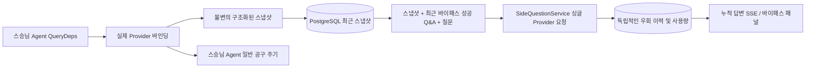

# ARTEX `/btw`

일반채팅、임무 MainAgent 및 현재 작업 자체 Worker 독립적인 우회 질문 지원。기본 입력 상자 입력 `/btw 질문` 제출 가능，비어 있음 `/btw` 또는“부가 질문”기록 열기 버튼。데스크톱에서는 너비 조절이 가능한 사이드바를 사용합니다.，모바일 버전 Drawer。

바이패스 답변은 제출 당시 에이전트 컨텍스트 스냅샷을 기반으로 생성되며 스트리밍 표시, 질문, 중지 및 삭제를 지원합니다. 패널을 닫거나 페이지를 새로 고치거나 SSE 연결을 끊어도 모델 요청이 취소되지 않습니다. 정지는 전류 바이패스에만 영향을 미칩니다. 지우면 우회가 취소되고 기본 컨텍스트 스냅샷을 유지하면서 우회 기록이 삭제됩니다.

## 경계를 깨달아라

Go, norma v0.3.7, Next.js 및 기존 Markdown/ResizingPanel/Drawer/AlertDialog 구성 요소를 상속합니다. 노마 소스 코드를 수정하거나 우회를 위한 종속성을 추가하지 않습니다. Planner로의 업그레이드, 다른 작업에서 상속된 작업자 및 도구 유형 하위 작업은 이 범위에 포함되지 않습니다.

- `capture.go` 에서만 `Options.Deps.CallModel / CallModelSync` 메인 루프 요청 표시。Provider 데코레이터는 콘크리트 모델 내부에 있습니다.、라우팅 풀의 외부 레이어를 선택한 후，그럼 실제 선택한 모델을 녹음해 보세요；압축 및 다이제스트 요청은 스냅샷을 덮어쓰지 않습니다.。
- 요청 시작、전체 모델 답변、최종 상태 릴리스 스냅샷 실행。생성 중인 반부분 응답은 게시되지 않습니다.；도구 호출이 통과되었습니다. norma 님 `MessagesForAPI` 페어링 유지，도구 결과는 다음 주요 모델 요청 시 스냅샷에 입력되거나 최종 상태를 실행합니다.。스트리밍 중단이 마지막 유효 경계를 유지합니다.。
- 스냅샷은 JSON 전체 복사본을 통해 구조화된 메시지, 시스템 프롬프트, 도구 정의 및 생성 매개변수를 보존합니다. 모델 추론은 스냅샷 잠금이나 데이터베이스 트랜잭션을 유지하지 않습니다.
- `SideQuestionService` 특정 통화 Provider；필요한 경우 우회 요약 생성，최종 답변은 처음으로 context를 초과해서 아직 텍스트가 출력되지 않은 경우입니다./도구 호출 시 감소 후 재시도 허용。생성되지 않음 agent session，공구 액추에이터에 연결되지 않음、스승님 transcript、활동 흐름 또는 작업 다이어그램，작업 모델을 통해 체인을 전환하지도 않습니다.。답은 기존 구조화된 도구 컨텍스트와의 호환성을 위해 도구 정의를 유지하는 것입니다.；추상 요청은 도구를 제공하지 않습니다.。새로 반환된 도구 호출에 실행 경로가 없습니다.。
- 상위 세션당 실행 중인 요청 1개, 단일 서비스 프로세스 최대 4개, 단일 시간 제한 120초. Bypass는 서비스 수명주기에 따라 별도의 취소 컨텍스트를 사용합니다.
- 우회 요청은 모델 구성 참조 및 중요하지 않은 ID 다이제스트를 보존합니다. 자격 증명은 요청 시 기존 구성에서 가져옵니다. 구성이 삭제되거나 모델, 프로토콜, 주소 등의 ID 필드가 변경되면 먼저 마스터 에이전트를 실행하여 스냅샷을 업데이트해야 합니다. 테스트는 제품 기본 모델을 변경하지 않습니다.

## 지속성과 회복성

`db/schema.sql` 자동으로 생성됨 `side_question_sessions` 그리고 `side_question_requests`。전자는 상위 리소스를 저장합니다.、최근 스냅샷、실행번호、버전과 클린 버전；후자가 문제를 해결합니다.、누적 답변、상태、모델、스냅샷 시간、복용량、이벤트 일련번호 및 호출 일련번호。

상위 세션 키는 대화 ID 또는 작업 ID + 탐색 ID + 의도 ID를 사용합니다. 작업자는 재사용 가능한 실행 슬롯 이름 지정을 사용하지 않습니다.

스냅샷은 상위 세션에서 병합되고 작성됩니다.，매 250 ms 새로고침 한 번，데이터베이스 비교 `(run_id, version)` 이전 버전 덮어쓰기 방지。바이패스 커밋 전에 선택한 스냅샷을 다시 저장하세요.。저장 성공 후 메모리의 대용량 스냅샷을 해제합니다.；실패할 경우를 대비해 버전을 작성해 두세요.。누적 콘텐츠는 최대 스트리밍 이벤트가 도착할 때마다 발생한다는 것이 정답입니다. 250 ms 한번 써보세요，최종 상태는 즉시 저장되며 데이터베이스 오류가 발생할 경우 제한된 시간 내에 다시 시도됩니다.。

서비스 스타트업은 레거시가 될 것입니다 `running` 요청은 다음과 같이 표시됩니다. `interrupted`，라이브러리에 떨어뜨린 답변과 사용법 중 일부를 보관합니다.，요청을 자동으로 재생하지 않음。최근에 성공적으로 저장된 컨텍스트는 다음 질문에 직접 사용될 수 있습니다.。이전 세션에 스냅샷이 없을 경우, 메인 세션을 먼저 실행해야 합니다. Agent，불복종 UI 활성 레코드 재구성 컨텍스트。

제거 작업은 제거 버전을 늘리고 요청을 삭제합니다. 조건부 업데이트는 늦은 콜백이 다시 기록되는 것을 방지합니다. 물리적 상위 리소스 삭제는 외래 키 계단식에 의존하며 작업자 삭제 표시는 동일한 트랜잭션 내에서 바이패스 데이터를 삭제하고 후속 늦은 스냅샷을 거부합니다. 작업 보관은 먼저 새 요청을 차단하고 기본 프로세스가 중지될 때까지 기다린 후 취소하고 우회가 삭제될 때까지 기다립니다. 아카이브 형식은 v3이며 우회 테이블 없이 v1/v2와 호환됩니다.

이력은 완전히 저장되며, 일련번호 커서로 페이지당 최대 20개 항목을 반환할 수 있습니다. 모델은 최근 성공한 Q&A 원본 텍스트의 재생을 최대 20개까지 요청하며 토큰 예산에 따라 재생 볼륨을 제한합니다. 이전 Q&A는 독립적인 롤링 요약을 유지합니다. 기본 컨텍스트가 예산을 초과하면 바이패스 복사본의 이전 부분만 요약되어 최근의 구조화된 도구 호출 및 결과가 유지됩니다. 요약 및 준비 진행 상황은 사용량과 함께 우회 동시성, 취소, 120초 제한 시간에 포함됩니다. 자세한 내용은 [컨텍스트 예산 및 오픈소스 참조](CONTEXT_BUDGET.md)를 참조하세요.

## HTTP 계약

다음 경로는 다음과 같습니다. `{parent}`，기존 인증 및 리소스 확인을 사용합니다.：

- `/api/conversations/{id}`
- `/api/tasks/{id}/chat`
- `/api/tasks/{id}/intents/{iid}`

| 요청 | 반품 및 동작 |
| --- | --- |
| `GET {parent}/side-questions?before={ordinal}` | `items` 최신 항목부터 오래된 항목 순으로 정렬됩니다.、독립 `current` 실행상태、`snapshot` 메타정보、`next_cursor`；커서는 0 은 최신 페이지를 나타냅니다. / 다음 페이지가 없습니다 |
| `POST {parent}/side-questions` | JSON `{ "question": "…", "client_request_id": "UUID" }`；새 요청이 반환되었습니다. 202 및 요청 개체；마찬가지예요 ID 및 문제가 기존 개체를 반환합니다. 200 |
| `DELETE {parent}/side-questions` | 현재 상위 세션의 바이패스 Q&A 취소 및 삭제 |
| `GET /api/side-questions/{requestID}/events` | `snapshot` SSE 이벤트，`id` 은 증가하는 일련번호입니다.，`data` 은 완전 누적 요청 객체입니다.；삭제되면 전송됩니다. `cleared` |
| `POST /api/side-questions/{requestID}/cancel` | 명시적 취소；최종 상태는 기록 또는 SSE 읽기 |

질문은 4000자로 제한됩니다. 스냅샷 없음, 모델 구성 변경, 동일한 상위 세션이 사용 중이거나 멱등성 ID 충돌이 409를 반환합니다. 전역 동시성 제한은 429를 반환합니다. 각 SSE 연결은 클라이언트가 수신한 이전 텍스트 조각에 의존하지 않고 먼저 누적 상태를 보냅니다. 프런트 엔드는 요청 ID + 시퀀스 번호로 병합하고 상위 세션을 전환하고 지울 때 이전 콜백을 삭제합니다.

## 확인 및 참고

자동 검사, 실제 모델 사용법 및 알려진 제한 사항은 [VALIDATION.md](VALIDATION.md)를 참조하세요.

단독 참고요청 [Grok CLI side-question.ts（고정 제출）](https://github.com/superagent-ai/grok-cli/blob/fb97af83f06dca873281d60168430f06c8de6324/src/utils/side-question.ts)，격리 실행 참조 [OpenCode（고정 제출）](https://github.com/anomalyco/opencode/tree/b3f1a96c6dd7adeb28b36dd11add1998fc84d67b)。ARTEX 의 상황별 사용 norma 에 대한 구조화된 메시지，프런트 엔드 로그에서 텍스트를 연결하는 방법은 사용되지 않습니다.。
