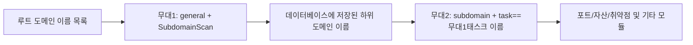

---

## name: scopesentry-mcp
설명: ScopeSentry MCP를 통해 보안 스캐닝 플랫폼(프로젝트, 작업, 템플릿, 자산, 노드)을 관리합니다. 사용자가 ScopeSentry, MCP, API 키, 스캔 작업 및 자산 쿼리를 언급할 때 사용됩니다.

# ScopeSentry MCP 사용자 가이드

ScopeSentry 인스턴스를 배포한 사용자의 경우. Cursor(또는 다른 MCP 클라이언트)를 통해 플랫폼에 연결하세요. 로컬 소스 코드는 필요하지 않습니다.

## 1. 준비사항

### 1.1 서비스 접속이 가능한지 확인

- 기본값 Web 인터페이스：`http://<호스트>`
- MCP 끝점：`http://<호스트>/mcp`（앞에 역방향 프록시나 프런트엔드 프록시가 있는 경우，실제 기준 `/mcp` 주소가 우선합니다.）

### 1.2 API 키 생성

1. 브라우저 로그인 ScopeSentry 웹 인터페이스
2. **API Key** 관리 페이지에 접속하여 키 생성(또는 관리자가 제공하는 인터페이스를 통해 생성)
3. 반환된 내용을 저장합니다. `ssk_...` 문자열（**한 번만 표시됩니다.**）

### 1.3 커서 MCP 구성

커서 → 설정 → MCP → 서버 추가:

```json
{
  "mcpServers": {
    "scopesentry": {
      "url": "http://<호스트님>:8082/mcp",
      "headers": {
        "X-API-Key": "ssk_당신의 열쇠"
      }
    }
  }
}
```

도 사용할 수 있습니다.：`Authorization: Bearer ssk_당신의 열쇠`

구성 완료 후 다시 시작 MCP 또는 과부하 Cursor，도구 목록에 나타나는지 확인 `list_projects`、`list_assets` 등。

---

## 2. 도구 목록


| 도구                     | 목적                |
| ---------------------- | ----------------- |
| `list_projects`        | 태그별로 그룹화된 프로젝트 트리（항목 포함 ID） |
| `list_projects_data`   | 페이지가 매겨진 프로젝트 목록，이름으로 검색     |
| `get_project`          | 프로젝트 세부사항              |
| `create_project`       | 새로운 프로젝트              |
| `list_tasks`           | 스캔 작업 목록            |
| `get_task`             | 임무 내용              |
| `list_scan_templates`  | 스캔 템플릿 목록            |
| `get_scan_template`    | 템플릿 세부정보              |
| `list_plugin_modules`  | 파이프라인 모듈 이름 검색 중          |
| `list_plugins`         | 사용 가능한 플러그인（포함 hash、기본 매개변수） |
| `create_scan_template` | 스캔 템플릿 만들기            |
| `create_scan_task`     | 검사 작업 생성            |
| `list_assets`          | 다양한 자산 조회（페이지가 매겨진 목록）       |
| `count_assets`         | 자산수 계산（`/api/assets/common/total`） |
| `get_asset_detail`     | 자산 또는 취약점 세부정보           |
| `add_asset_tag`        | 자산에 태그 추가           |
| `list_nodes`           | 스캔 노드 목록            |


각 공구 매개변수는 MCP 도구 설명（schema）이 우선합니다；`list_assets` / `count_assets` 님 search、filter 구문이 일관됩니다.，자산을 쿼리하기 전에 읽을 수 있습니다. `list_assets` description。

알아야 해「메시지는 총 몇 개인가요?」일 때 사용됩니다. `count_assets`（해당 Web 총 페이지 인터페이스 수），합계를 계산하기 위해 페이지를 여러 번 넘길 필요가 없습니다. `list_assets`。

---

## 3. 공통 작업흐름

### 3.1 프로젝트별 자산 확인

사용자 또는 컨텍스트일 때**이미 프로젝트 조건이 있음**시간，먼저 가져오세요 `filter.project` 범위를 좁혀보세요，프로젝트 간 데이터가 너무 많아 응답 속도가 느려지는 것을 방지하세요.。명확한 프로젝트가 없는 경우，프로젝트 필터링 추가는 필수는 아닙니다.。

1. `list_projects` 또는 `list_projects_data` 대상 프로젝트 가져오기 **ObjectID**（`id` / `children[].value`）
2. `list_assets` 들어옴 `filter.project`（**반드시 ID，프로젝트의 중국어 이름을 쓸 수 없습니다.**）

```json
{
  "asset_type": "asset",
  "pageIndex": 1,
  "pageSize": 20,
  "search": "domain=^example.com",
  "filter": {
    "project": ["<프로젝트ObjectID>"]
  }
}
```

### 3.2 스캐닝 작업 생성

1. `list_nodes` 온라인 노드 이름을 가져옵니다.
2. `list_scan_templates` 또는 `create_scan_template` 템플릿 받기 **ObjectID**
3. `create_scan_task`：`name`、`node` 필수，`template` 템플릿을 작성하세요. ID（템플릿 이름을 입력할 수 없습니다.）

**대상 소스 `targetSource`（그리고 Web 일관성 있게 종료）：**

| targetSource | 설명 | 필수 매개변수 |
| --- | --- | --- |
| `general` | 대상을 직접 입력하세요 | `target` |
| `project` | 프로젝트에서 대상 읽기 | `project`（프로젝트 ObjectID 배열） |
| `asset` | 님으로부터 Web 자산 라이브러리 검색 | `search`；선택사항 `project`、`filter`、`targetNumber` |
| `RootDomain` | 루트 도메인 이름 데이터베이스에서 검색 | `search`；선택사항 `project`、`filter`、`targetNumber` |
| `subdomain` | 하위 도메인 데이터베이스에서 검색 | `search`；선택사항 `project`、`filter`、`targetNumber` |
| `UrlScan` | 님으로부터 URL 스캔 결과 검색 | `search`；선택사항 `project`、`filter`、`targetNumber` |
| `*Source`（ `subdomainSource`） | 자산 페이지에서「선택됨/검색」생성 | `targetTp=search` 일 때 사용됩니다. `search`；`targetTp=select` 일 때 사용됩니다. `targetIds` |

**예: 루트 도메인 이름을 직접 검색합니다.**

```json
{
  "name": "example-하위 도메인 이름 수집",
  "node": ["node-1"],
  "template": "<템플릿ObjectID>",
  "targetSource": "general",
  "target": "example.com\nfoo.com",
  "project": ["<프로젝트ObjectID>"]
}
```

**예 - 하위 도메인 이름 데이터베이스에서 계속 검색(이전 작업 이름으로 필터링):**

```json
{
  "name": "example-포트 및 취약점",
  "node": ["node-1"],
  "template": "<후속 모듈 템플릿ObjectID>",
  "targetSource": "subdomain",
  "search": "task==\"example-하위 도메인 이름 수집\"",
  "project": ["<프로젝트ObjectID>"]
}
```

### 3.3 루트 도메인 이름의 전체 정보 수집(2단계 권장)

입력이 **루트 도메인 이름**이고 **전체 정보 수집**이 필요한 경우 전체 파이프라인을 한 번에 실행하는 대신 두 번에 걸쳐 스캔하는 것이 좋습니다.

**원인:** 분산 작업이 **단일 대상** 단위로 분산됩니다. 루트 도메인 이름을 대상으로 사용하는 경우 노드에 루트 도메인 이름이 할당된 후 노드에서 휩쓸린 하위 도메인 이름이 해당 노드에서 후속 모듈을 계속 실행하므로 부하가 고르지 않고 속도가 느려지며 오류가 발생하기 쉽습니다.

**모범 사례:**

1. **1단계—하위 도메인 이름만 수집**
   - `targetSource`: `general`
   - `target`: 모든 루트 도메인 이름（여러 줄）
   - 템플릿：활성화만 가능 `SubdomainScan`、`SubdomainSecurity`（하위 도메인 이름 검색 + 하위 도메인 이름 탈취）
   - 사용 `get_task` 작업 완료를 기다리는 중입니다.

2. **2단계 - 후속 모듈**
   - `targetSource`: `subdomain`
   - `search`: `task=="<1단계 작업 이름>"`（작업 이름과 정확히 일치합니다.）
   - 선택사항 `project` 범위를 좁혀보세요
   - 템플릿: 포트 스캐닝, 자산 매핑, 취약점 스캐닝 등(SubdomainScan을 포함할 수 없음)
   - 하위 도메인 이름은 각 노드에 독립적인 대상으로 배포되어 병렬 효율성이 더 높습니다.

웹 인터페이스의 "하위 도메인 이름" 자산 페이지에서 작업 이름으로 필터링한 후 "하위 도메인 이름에서 작업 생성"을 사용할 수도 있으며 동일한 효과가 있습니다.



### 3.4 스캔 템플릿 만들기

1. `list_plugin_modules` → 모듈 이름 목록
2. `list_plugins`（누를 수 있음 `module` 필터）→ 각 플러그인 `hash` 및 기본값 `parameter`
3. `create_scan_template`：사용 `modules` 지정「모듈 → 플러그인 hash 배열」

---

## 4. 자산 쿼리（`list_assets` / `count_assets`）

`count_assets` 그리고 `list_assets` 똑같이 사용하세요 `asset_type`、`search`、`filter`，복귀 `{ "total": N }`，해당 Web 끝 `/api/assets/common/total`。

```json
{
  "asset_type": "subdomain",
  "search": "task==\"특정 작업 이름\"",
  "filter": {"project": ["<프로젝트ObjectID>"]}
}
```

**성능 제안（`list_assets` / `count_assets` 일반）：** 프로젝트 조건이 있을 경우 우선순위를 부여한다 `filter.project` 범위를 좁혀보세요；`search` 생성된 인덱스 필드를 최대한 활용해보세요. `==` 합동 또는 `^` 접두사 일치（또 만나요 [4.3](#43-search-검색식)），넓은 공간은 피하세요 `=` 퍼지 쿼리로 인해 응답 속도가 느려짐。프로젝트 컨텍스트가 없으면 프로젝트 필터링이 강제되지 않습니다.。

지원 `filter.project` 유형을 확인하세요. [4.4](#44-filter-정확한 필터링) 양식。

### 4.1 자산 유형 `asset_type`

`asset`、`RootDomain`、`subdomain`、`app`、`mp`、`UrlScan`、`SensitiveResult`、`DirScanResult`、`crawler`、`vulnerability`、`PageMonitoring`、`IPAsset`、`SubdomainTakerResult`

별칭 예：`web`→asset、`vuln`→vulnerability、`ip`→IPAsset、`url`→UrlScan

### 4.2 매개변수 설명


| 매개변수                       | 설명                                      |
| ------------------------ | --------------------------------------- |
| `pageIndex` / `pageSize` | 페이징，기본값 1 / 20                            |
| `search`                 | 검색식（다음 섹션 참조）                              |
| `filter`                 | 정확한 필터링 JSON（다음 섹션 참조）                          |
| `sort`                   | 만 UrlScan、DirScanResult 지원언론 `length` 정렬 |
| `sid`                    | 만 SensitiveResult：중요한 규칙 이름                |


`search` 그리고 `filter` **동시 사용 가능**。

### 4.3 검색 검색식

사용자 정의 DSL(**SQL 아님**):


| 운영자  | 의미   | 색인 | 예                          |
| ---- | ---- | ---- | --------------------------- |
| `=`  | 퍼지 매칭（regex） | 인덱싱 없음 | `domain=example`            |
| `==` | 정확히 일치（합동） | **색인 바로가기** | `port==443`                 |
| `!=` | 제외   | — | `port!="80"`                |
| `&&` | 그리고    | — | `domain==example.com && port==443` |
| `||` | 또는    | — | `title=admin || body=login` |


**인덱스 및 연산자：** `domain`、`ip`、`port`、`title` 및 기타 필드가 색인화되었습니다.，하지만 단지 **`==` 합동** 또는 **값은 다음으로 시작합니다. `^` 으로 시작하는 접두사 일치**（ `domain=^example.com`）색인 가능；**`=` 은(는) 다음으로 변환됩니다. regex 퍼지 매칭，인덱스를 사용할 수 없습니다.**，데이터 양이 많을수록 속도가 느려지는 경향이 있습니다.。

**모든 기종 공통 search 필드：** `tag`、`task`（작업 이름）、`rootDomain`

**project 은(는) 쓸 수 없습니다. search 내부**（유효하지 않거나 `&&` 결합시 오류가 발생했습니다.）。체질물을 이용해주세요 `filter.project`。

**일반적으로 사용되는 다양한 유형의 검색 필드:**


| asset_type           | 필드                                                                                  |
| -------------------- | ----------------------------------------------------------------------------------- |
| asset                | domain, ip, port, service, app, title, statuscode, icon, banner, type, body, header |
| RootDomain           | domain, icp, company                                                                |
| subdomain            | domain, ip, type, value                                                             |
| app                  | name, icp, company, category, description, url, apk                                 |
| mp                   | name, icp, company, category, description, url                                      |
| UrlScan              | url, input, source, resultId, type                                                  |
| SensitiveResult      | url, sname, body, info, md5                                                         |
| DirScanResult        | url, statuscode, redirect, length                                                   |
| vulnerability        | url, vulname, matched, request, response, level                                     |
| crawler              | url, method, body, resultId                                                         |
| PageMonitoring       | url, hash, diff, response                                                           |
| IPAsset              | ip, domain, port, service, webServer, app                                           |
| SubdomainTakerResult | domain, value, type, response                                                       |


**검색 예:**

- `domain==www.example.com && port==443`（합동，색인 바로가기）
- `domain=^example.com`（접두사 일치，색인 바로가기）
- `ip==192.168.1.1`
- `task=="특정 작업 이름"`
- `level==high`（vulnerability）
- `statuscode==200`（DirScanResult）

퍼지 포함이 필요한 경우 재사용 `=`， `title=admin`（인덱싱 없음，프로젝트 및 기타 여건에 따라 범위를 좁히는 것이 좋습니다.）。

### 4.4 필터 정밀 필터링

JSON 개체: 동일한 키를 가진 여러 값은 **OR**이고, 다른 키는 **AND**입니다.

**프로젝트 조건이 있을 경우 우선순위를 부여한다 `project`：** 사용자 또는 컨텍스트가 항목을 지정한 경우，그리고 asset_type 지원 `project`，을 가져와 범위를 좁혀야 합니다.；프로젝트 정보가 없을 경우 필수는 아닙니다.。


| filter key   | 의미       | 값 설명                                                     |
| ------------ | -------- | -------------------------------------------------------- |
| `project`    | 프로젝트     | **ObjectID**，사용 `list_projects` / `list_projects_data` 받기 |
| `task`       | 소스 태스크     | **작업 이름**，사용 `list_tasks` 님 `name`                         |
| `port`       | 포트       |  `"443"`                                                |
| `service`    | 서비스/동의    |  `"https"`                                              |
| `app`        | 지문 적용     |  `"Nginx"`                                              |
| `icon`       | 아이콘 hash  |                                                          |
| `statuscode` | HTTP 상태 코드 | 주로 사용됩니다. asset                                               |
| `status`     | 상태       | UrlScan/DirScan HTTP 코드；취약점/민감정보 처리현황                       |
| `level`      | 취약점 수준     | critical / high / medium / low / info                    |
| `type`       | 유형       | 하위 도메인 이름 레코드 유형 등 A、CNAME                                         |
| `color`      | 민감한 규칙 색상   | SensitiveResult                                          |
| `sname`      | 민감한 규칙 이름    | SensitiveResult                                          |
| `tags`       | 태그       |                                                          |


**각 유형에 사용 가능한 필터 키:**


| asset_type                            | filter key                                                      |
| ------------------------------------- | --------------------------------------------------------------- |
| asset                                 | project, port, service, app, icon, statuscode, type, task, tags |
| RootDomain                            | project, tags                                                   |
| subdomain                             | project, type, task, tags                                       |
| app / mp                              | project, tags                                                   |
| UrlScan                               | status, tags                                                    |
| DirScanResult                         | status, tags                                                    |
| SensitiveResult                       | status, color, sname, tags                                      |
| crawler                               | project, task, tags                                             |
| vulnerability                         | project, level, status, task, tags                              |
| PageMonitoring / SubdomainTakerResult | tags                                                            |
| IPAsset                               | project, port, service, app                                     |


**필터 예:**

```json
{"project": ["<프로젝트ObjectID>"], "port": ["443"]}
```

**결합 쿼리 예시:**

```json
{
  "asset_type": "asset",
  "search": "domain=^baidu && port==443",
  "filter": {"project": ["<프로젝트ObjectID>"]},
  "pageIndex": 1,
  "pageSize": 10
}
```

**참고:**

- 프로젝트 여건이 있는 경우 우선적으로 지원하겠습니다. `filter.project`（지원 시）；프로젝트 컨텍스트가 없으면 필수는 아닙니다.
- `filter.project` 프로젝트 표시 이름을 입력하지 마세요.
- 알려진 값에 사용됩니다. `==`，접두사가 사용됩니다. `^`；큰 테이블 남용 방지 `=` 퍼지 매칭
- UrlScan 님 HTTP 상태의 경우 `filter.status`；DirScanResult 사용 가능 search 중국어 사용 `statuscode==200`
- SensitiveResult 규칙 이름별：`search` 사용 `sname=규칙 이름`，또는 `filter.sname`

### 4.5 정렬 정렬

**UrlScan** 및 **DirScanResult**만 지원:

```json
{"length": "ascending"}
```

다른 유형은 무시됩니다. `sort`，기본적으로 시간순 정렬。

---

## 5. 스캔 템플릿 모듈 이름

`TargetHandler`、`SubdomainScan`、`SubdomainSecurity`、`PortScanPreparation`、`PortScan`、`PortFingerprint`、`AssetMapping`、`AssetHandle`、`URLScan`、`WebCrawler`、`URLSecurity`、`DirScan`、`VulnerabilityScan`、`PassiveScan`

---

## 6. 문제 해결


| 현상        | 처리 중                                                 |
| --------- | -------------------------------------------------- |
| MCP 도구 없음   | 확인 URL、API Key、ScopeSentry 실행되고 있나요?                    |
| 401 / 403 | 재생성 또는 교체 API Key                                    |
| 자산을 찾을 수 없습니다.     | 확인 `filter.project` 입니다 ObjectID；여기 있지 마세요 search 쓰기 project |
| 템플릿/태스크 생성 실패 | `template` 템플릿이어야 합니다. ObjectID；`node` 온라인 노드 이름을 입력하세요.            |
| 쿼리가 매우 느립니다./막혔어요   | 프로젝트가 있으면 추가하세요. `filter.project`；search 색인이 생성된 필드에 대신 사용 `==` 또는 `^` 접두사，아껴서 사용하세요 `=`；축소 `pageSize` |


---

